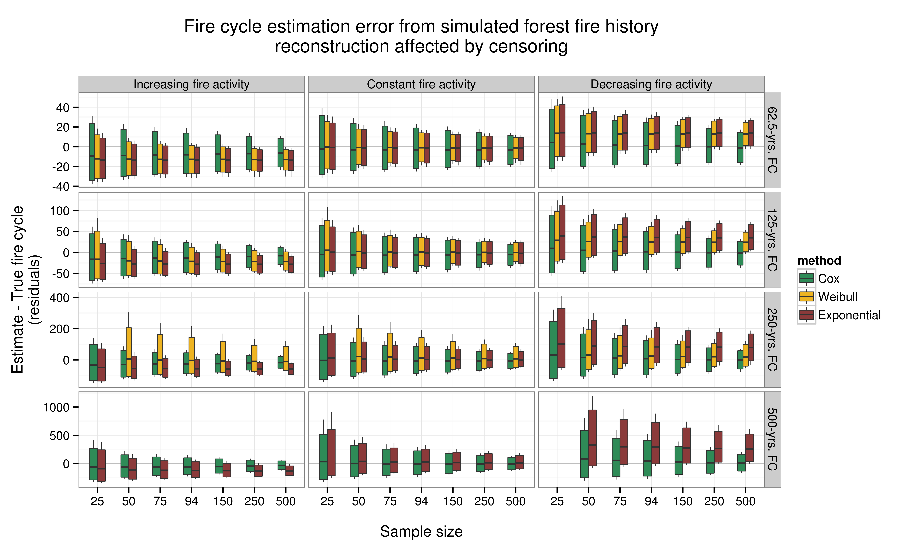
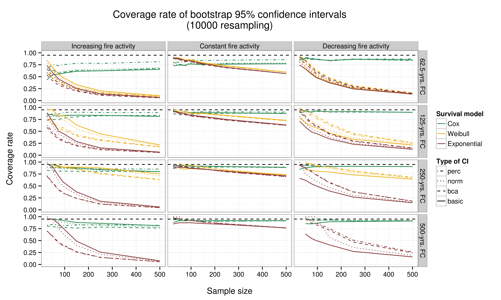

# Accuracy and precision of three survival-based methods for estimating fire cycle from dendroecological data

[Dominic Cyr][5]

Updated on Mar 18 2016

-----------

### General description

The present repository contains all that's necessary to reproduce the simulation experiment conducted by [Cyr _et al_. (working manuscript)][1].

That experiment aims at assessing the accuracy and precision of three types of fire estimation methods based on common survival models that are commonly used in engineering, medical science and actuarial science, among others field interested in modelling time-to-event data. Here we used them to model dendroecological reconstruction of fire history in forested boreal landscape.

The conditions within which those methods may be used in _real world_ applications are also simulated.

-----------

### Main results

If you've already read our paper (and have been convinced by the results) and just want to estimate fire cycle from similar data, [click here to find _R_ functions that allows to do just that][2].

-----------

### Additionnal information

If you are rather interested in getting more information about the simulation experiment, want to reproduce it or adapt it to you own needs, we strongly suggest you get a look at [this graphic illustration of the simulation and data processing pipeline][3].

In the root folder you will find the _R_ scripts that must be executed by the user, in opposition to those located in the [./scripts][2] folder. The latter are sourced by the former and do not necessitate direct interactions by the user unless he/she wishes to modify them.

Don't hesitate to contact me should you have questions, comments or suggestions for improvement or additionnal functionalities.

[Dominic Cyr][5]

[2]: https://github.com/dcyr/survFire/scripts
[3]: https://github.com/dcyr/survFire/blob/master/pipeline.md
[5]: http://dominiccyr.ca
