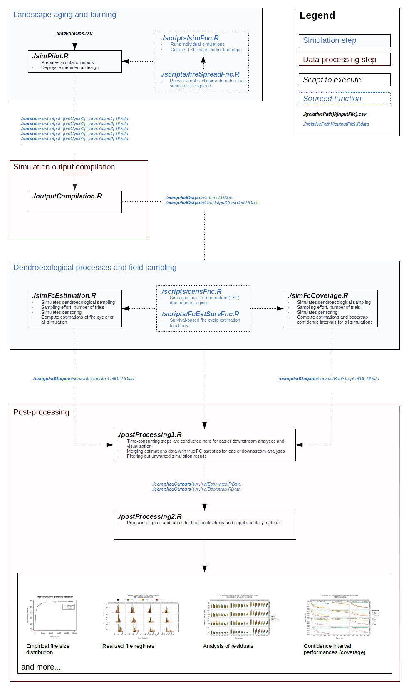

# Simulation and data processing pipeline
Dominic Cyr  

Updated on Mar 18 2016

-----------

The following describes the simulation and data processing pipeline that allows to reproduce the experiment conducted by [Cyr _et al_. (working manuscript)][1]. That experiment aims at assessing the accuracy and precision of three types of fire estimation methods based on common survival models. The conditions within which those methods may be used in _real world_ applications are also simulated.

For a specific description of the estimation methods, please refer to the [paper itself][1]. For more details about the implementation in R, _per se_, [click here][2].

The following figure illustrates the six scripts that should be executed in sequence by the user. Note that the simulation steps may takes hours to execute depending on the simulation parameters even if many of them make use of parallel calculations. To allow for testing and proper verification of the ouputs at each steps, they are always first written in a folder named after the current date (ex. "_./{Sys.date}/outputs.file_"). They must then be copied manually into the folder indicated below in order to serve as inputs for downstream processing.

Don't hesitate to contact me should you have questions, comments or suggestions for improvement or additionnal functionalities.

[Dominic Cyr][5]

-----------

[2]: https://github.com/dcyr/survFire/scripts
[3]: https://github.com/dcyr/survFire/blob/master/pipeline.md
[5]: http://dominiccyr.ca
